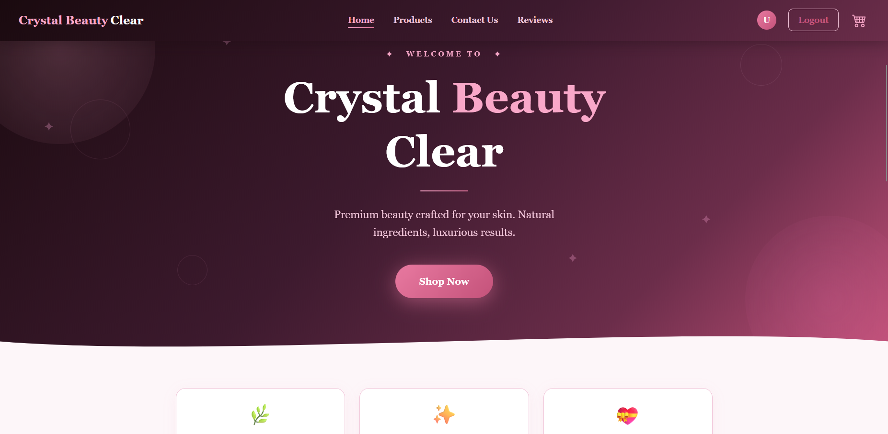
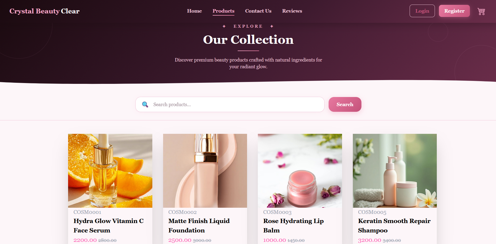
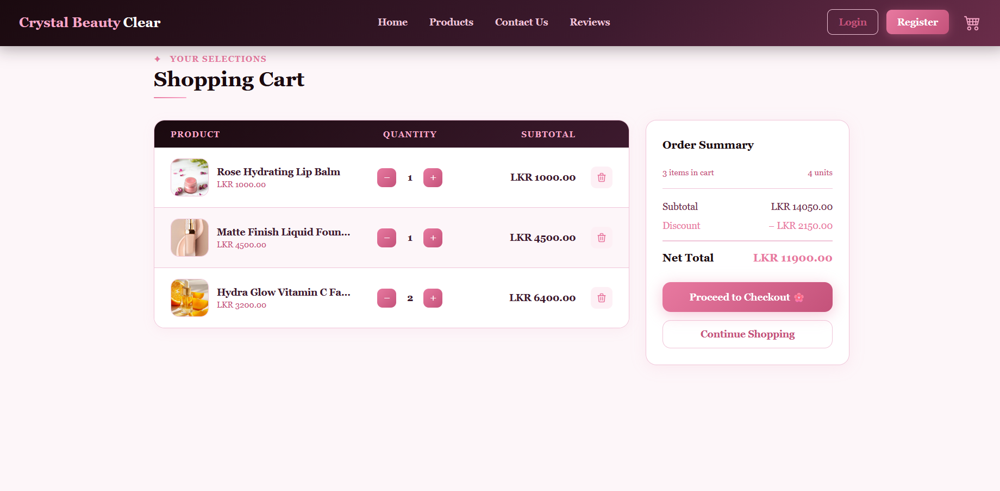
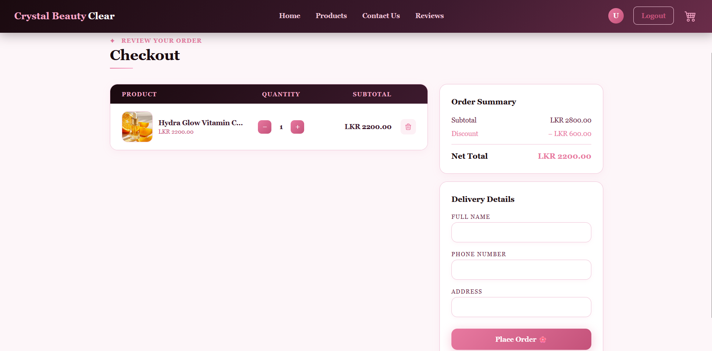
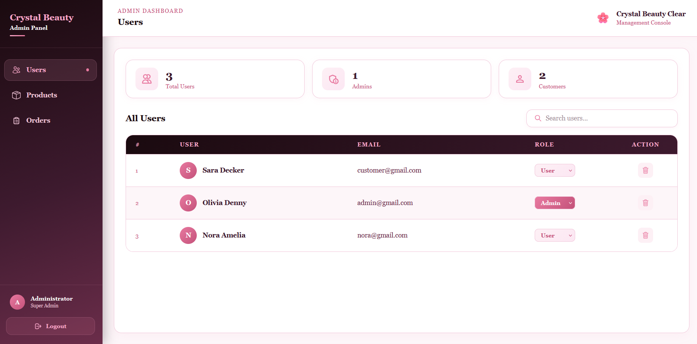
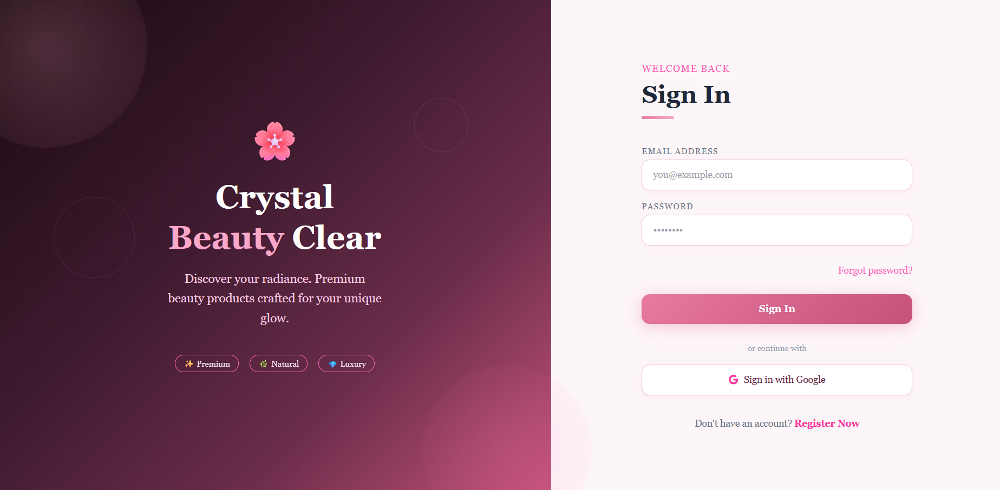

# Crystal Beauty Clear – Frontend

A modern full-stack e-commerce web application for beauty products, built using the MERN stack.  
This repository contains the **frontend (React.js)** of the system.

---

## 🚀 Features

- 🔐 User Authentication (JWT & Google OAuth)
- 🛍️ Product listing, search, and product overview
- 🛒 Shopping cart with real-time quantity updates
- 💰 Dynamic price calculation (Total, Discount, Net Total)
- 💳 Complete checkout flow
- 👩‍💻 Admin dashboard for managing users, products, and orders
- 📱 Fully responsive UI with a luxury beauty aesthetic

---

## 🛠️ Technologies Used

- React.js  
- JavaScript (ES6+)  
- Tailwind CSS  
- Axios  
- React Router  
- GitHub  

---

## 📸 Screenshots

### 🏠 Hero Product Page

### 🔍 Browsing Experience

### 🛒 Shopping Cart

### 💳 Checkout Flow

### 👩‍💻 Admin Dashboard

### 🔐 Sign In (Google OAuth)

## 🔗 Backend Repository

👉 https://github.com/AAKDIVYANGANA/cbc-backend

---

## 🙌 About the Project

This project was developed to enhance my full-stack development skills using the MERN stack, with a focus on building real-world e-commerce functionality such as authentication, shopping cart management, and a complete checkout system.

